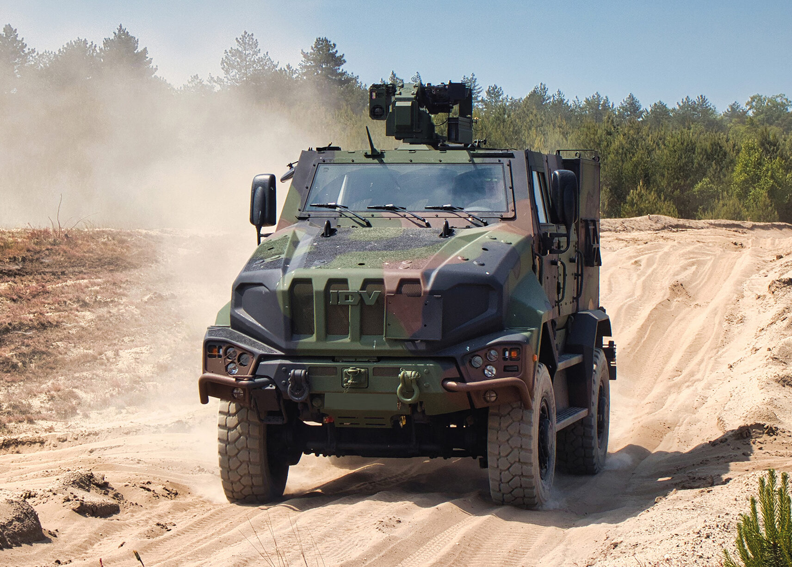
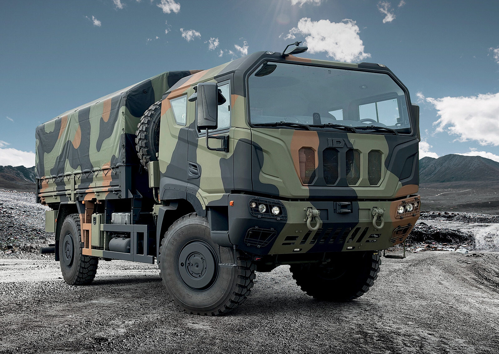

<!-- Title Slide is inserted automatically -->

## Slide

- This uses the IDV PPT template.
- Pandoc will automatically apply the correct slide layout based on the content of each slide.
- **Bold text** and *italic text*.
- A list of supported pptx options can be found in the [Quarto documentation](https://quarto.org/docs/reference/formats/presentations/pptx.html).

---

## Text size filter

This is normal text.

[This is smaller text]{.small}

[This is very small text]{.very-small}

---

## Slide with text and image

This slide contains both text and an image.


<!-- SECTION  HEADER SLIDE-->

# Section Header Slide

---

- No title, just content.

---

## incremental list
::: {.incremental}

- Eat spaghetti
- Drink wine

:::

---

## non incremental list
::: {.nonincremental}

- Eat spaghetti
- Drink wine

:::

---

## Two-column layout

:::: {.columns}

::: {.column}
contents...
:::

::: {.column}
contents...
:::

::::

---

# Slide Title {background-image="resources/media/tank_tracks_on_the_ground_sky_reflecting.jpg"}

---

## Slide with speaker notes

Slide content

::: {.notes}
Speaker notes go here.
:::

---

## Tables

| Tables        | Are           | Cool  |
| ------------- |:-------------:| -----:|
| col 3 is      | right-aligned | $1600 |
| col 2 is      | centered      |   $12 |
| zebra stripes | are neat      |    $1 |


## Mermaid diagrams

Mermaid flow chart example:

```{mermaid}
%%| fig-width: 40%
flowchart LR
  A[Hard edge] --> B(Round edge)
  B --> C{Decision}
```

---

## code c++

```{.cpp}
#include <iostream>

int main() {
  std::cout << "Hello, World!" << std::endl;
  return 0;
}
```

## code matlab

```{.matlab}
x = linspace(0, 10, 100);
y = sin(x);
```

---

## code python

```{.python}
import matplotlib.pyplot as plt
import numpy as np
x = np.linspace(0, 10, 100)
y = np.sin(x)
plt.plot(x, y)
plt.show()
```

---

## Slide with executed python code

```{python}
#| tags: [parameters]

alpha = 0.1
ratio = 0.1
```

:::: {.columns}

::: {.column}

```{.python}
import matplotlib.pyplot as plt
import numpy as np
x = np.linspace(0, 10, 100)
y = np.sin(x) * alpha + np.cos(x) * ratio
plt.plot(x, y)
plt.show()
```
:::

::: {.column style="vertical-align: top;"}

```{python}
#| label: fig-example
#| fig-cap: "An example plot generated from Python code using parameters."
#| width: 200px
import matplotlib.pyplot as plt
import numpy as np
x = np.linspace(0, 10, 100)
y = np.sin(x) * alpha + np.cos(x) * ratio
plt.plot(x, y)
plt.show()
```
:::

::::

---

## images

<!-- 4 images in 2 columns -->
:::: {.columns}
::: {.column}
{width=20%}

{width=20%}
:::
::: {.column}
{width=20%}

{width=20%}
:::
::::

